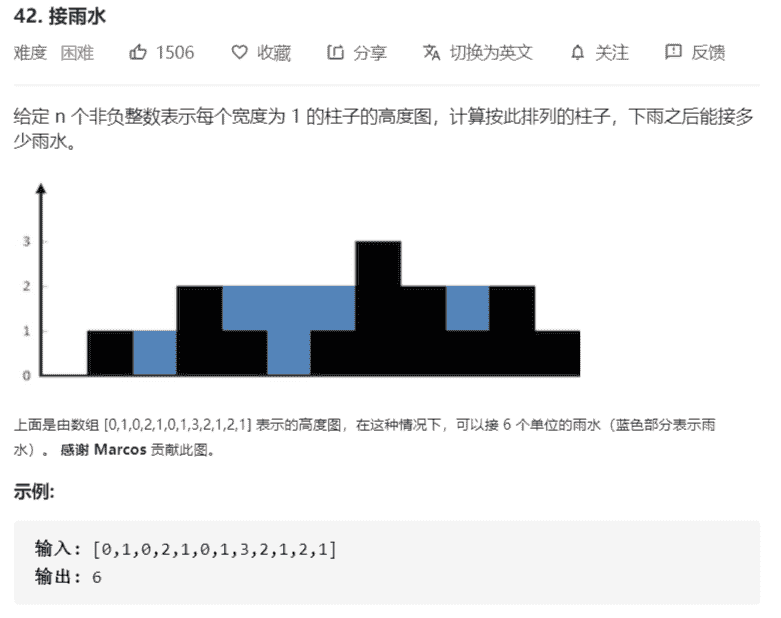

# 接雨水



解法：

```java
class Solution {
    public int trap(int[] height) {
        // 计算每根柱子上可以放的水
        // 1. 第一根和最后一根没有水
        // 2. 可以放水的柱子左右两边均有比其大的柱子，
        //  且放水量为两端最大值间的最小值
        if (height.length < 3) {
            return 0;
        }
        int lastIndex = height.length - 1;
        int[] leftMaxes = new int[height.length];
        for (int i = 1; i < lastIndex; i++) {
            leftMaxes[i] = Math.max(leftMaxes[i - 1], height[i - 1]);
        }

        int[] rightMaxes = new int[height.length];
        for (int i = lastIndex - 1; i > 0; i--) {
            rightMaxes[i] = Math.max(height[i + 1], rightMaxes[i + 1]);
        }

        int ans = 0;
        for (int i = 1; i < lastIndex; i++) {
            int min = Math.min(leftMaxes[i], rightMaxes[i]);
            if (min <= height[i]) {
                continue;
            }
            ans += min - height[i];
        }
        return ans;
    }
}
```

