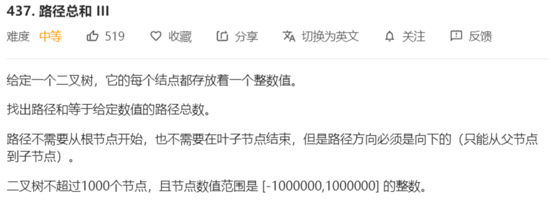
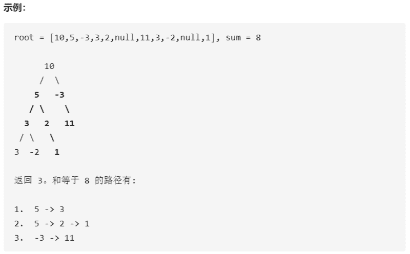

# 437-路径总和3





解法：

```java
class Solution {
    private int ans = 0;

    public int pathSum(TreeNode root, int sum) {
        preorderTraversal(root , sum);
        return ans;
    }

    private void preorderTraversal(TreeNode node, int sum) {
        if (node == null) {
            return;
        }
        dfs(node, sum);
        preorderTraversal(node.right, sum);
        preorderTraversal(node.left, sum);
    }

    private void dfs(TreeNode node, int remain) {
        if (node == null){
            return;
        }
        if (node.val == remain){
            ans++;
            dfs(node.left,0);
            dfs(node.right,0);
            return;
        }
        dfs(node.left, remain - node.val);
        dfs(node.right, remain - node.val);
    }
}
```

