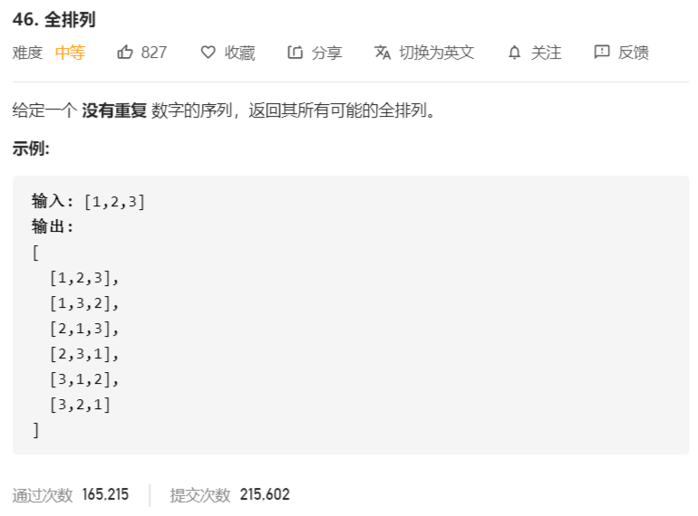

# 46-全排列



```java
class Solution {
    public List<List<Integer>> permute(int[] nums) {
        List<List<Integer>> res = new ArrayList<>();
        if (nums == null && nums.length < 1) {
            return res;
        }
        boolean[] choice = new boolean[nums.length];
        dfs(nums, new ArrayList<>(nums.length), res, choice);
        return res;
    }

    private void dfs(int[] nums, List<Integer> list, 
                     List<List<Integer>> res, boolean[] choice) {
        if (list.size() == nums.length) {
            // 已经到达最后一层
            res.add(new ArrayList<>(list));
            return;
        }
        for (int i = 0; i < nums.length; i++) {
            if (!choice[i]) {
                // choice[i] == false，表示未被选过，可选
                // 先将choice[i]状态标为不可选
                choice[i] = true;
                // 将当前可选值加入list
                list.add(nums[i]);
                // 选择下一个
                dfs(nums, list, res, choice);
                // 移除list的最后一个
                list.remove(list.size() - 1);
                // 恢复状态
                choice[i] = false;
            }
        }
    }
}

// 原地交换：分别将nums数组从i分别和从 i 到 length-1 进行交换
class Solution {
    public List<List<Integer>> permute(int[] nums) {
        res = new ArrayList<>();
        if (nums == null || nums.length < 1) {
            return res;
        }
        list = nums;
        dfs(0);
        return res;
    }

    private int[] list;
    private List<List<Integer>> res;

    private void dfs(int index) {
        // 不能再往下搜索
        if (index == list.length) {
            List<Integer> tmp = new ArrayList<>(index);
            for (int num : list) {
                tmp.add(num);
            }
            res.add(tmp);
            return;
        }
        // 状态枚举
        for (int i = index; i < list.length; i++) {
            // 将每一个位置从自身开始进行交换
            swap(index, i);
            dfs(index + 1);
            swap(index, i);
        }
    }

    private void swap(int i, int j) {
        int tmp = list[i];
        list[i] = list[j];
        list[j] = tmp;
    }
}
```

