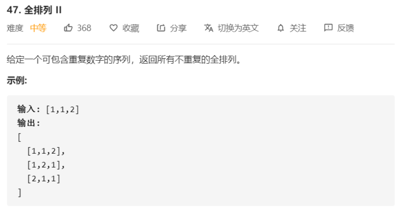

# 47-全排列2



解法：

```java
class Solution {
    public List<List<Integer>> permuteUnique(int[] nums) {
        List<List<Integer>> res = new ArrayList<>();
        if (nums == null || nums.length < 1) {
            return res;
        }
        dfs(0, res, nums);
        return res;
    }
    private void dfs(int index, List<List<Integer>> res, int[] nums) {
        // 不能再往下搜索
        if (index == nums.length) {
            List<Integer> tmp = new ArrayList<>(index);
            for (int num : nums) {
                tmp.add(num);
            }
            res.add(tmp);
            return;
        }
        // 状态枚举
        for (int i = index; i < nums.length; i++) {
            // 将每一个位置从自身开始进行交换
            // 如果该值没有交换过，则进行交换，如果已经交换过，则跳过
            if (noRepeat(nums, index, i)) {
                swap(index, i, nums);
                dfs(index + 1, res, nums);
                swap(index, i, nums);
            }
        }
    }
    
    private boolean noRepeat(int[] nums, int start, int end) {
        while (start < end && nums[start] != nums[end]) {
            start++;
        }
        return start == end;
    }

    private void swap(int i, int j, int[] nums) {
        int tmp = nums[i];
        nums[i] = nums[j];
        nums[j] = tmp;
    }
}
```

