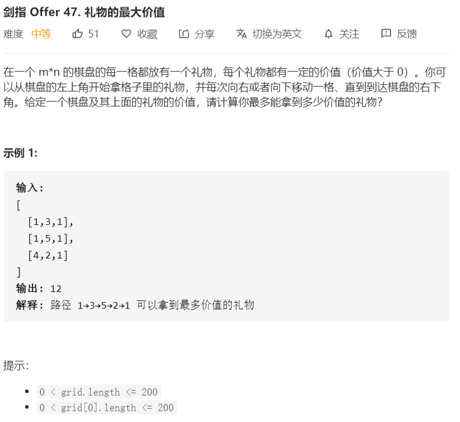

# 礼物的最大价值



解法：

```java
class Solution {
    public int maxValue(int[][] grid) {
        int row = grid.length;
        int col = grid[0].length;

        // 统一操作
        int[][] dp = new int[row + 1][col + 1];
        for (int i = 1; i <= row; i++) {
            for (int j = 1; j <= col; j++) {
                dp[i][j] = Math.max(dp[i - 1][j], dp[i][j - 1]) +
                    grid[i - 1][j - 1];
            }
        }
        return dp[row][col];
    }
}

class Solution {
    public int maxValue(int[][] grid) {
        int row = grid.length;
        int col = grid[0].length;

        int[][] dp = new int[row][col];
        dp[0][0] = grid[0][0];
        for (int i = 1; i < row; i++) {
            dp[i][0] = dp[i - 1][0] + grid[i][0];
        }
        for (int i = 1; i < col; i++) {
            dp[0][i] = dp[0][i - 1] + grid[0][i];
        }
        for (int i = 1; i < row; i++) {
            for (int j = 1; j < col; j++) {
                dp[i][j] = Math.max(dp[i - 1][j], dp[i][j - 1]) + grid[i][j];
            }
        }
        return dp[row - 1][col - 1];
    }
}
```

