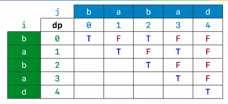

# 最长回文子串


解法：使用动态规划解题，画出dp表



假设字符串"babad"为s，它的长度为n，dp是大小为 n*n 的二维数组，`dp[i][j]` 表示 `s[i][j]`是否为回文串，存储为 true 、false

- 初始化：`dp[i][i] = 1`
- `dp[i][j]`：分两种情况
  - 如果 j - i + 1 <= 3 或 2时，`dp[i][j] = s[i]==s[j];`
  - 如果 j - i +1 > 3 或 2时，`dp[i][j] = dp[i+1][j-1] && (s[i] == s[j]);`

```java
class Solution {
    public String longestPalindrome(String s) {
        // 使用动态规划解题：dp[i][j]指的是i到j是否为回文串
        if (s.length() < 2) {
            return s;
        }
        char[] c = s.toCharArray();
        int len = c.length;

        boolean[][] dp = new boolean[len][len];
        // 初始化，dp[i][i] = true;
        for (int i = 0; i < len; i++) {
            dp[i][i] = true;
        }
        int left = 0;
        int max = 1;
        // dp[i][j]指i到j是否为回文串
        // 当 j-i<=2时，当c[i]==c[j]时为回文串
        // 当 j-i>2时：
        // dp[i+1][j-1]==true&&c[i]==c[j]，dp[i][j]=true
        for (int i = 1; i < len; i++) {
            for (int j = 0; j <= i; j++) {
                if (i - j <= 2) {
                    dp[j][i] = c[i] == c[j];
                } else {
                    dp[j][i] = c[i] == c[j] && dp[j + 1][i - 1];
                }
                // dp[j][i] = (c[i] == c[j]) && (i - j <= 2 || dp[j + 1][i - 1]);
                if (dp[j][i] && (i - j + 1) > max) {
                    max = i - j + 1;
                    left = j;
                }
            }
        }
        return String.copyValueOf(c, left, max);
    }
}
```

中心扩散法：

```java
class Solution {
    public String longestPalindrome(String s) {
        // 使用扩展中心法解题
        if (s.length() < 2) {
            return s;
        }
        char[] c = s.toCharArray();
        // 最大长度
        int max = 1;
        int left = 0;
        for (int i = c.length - 2; i >= 0; i--) {
            int l = i - 1;
            int r = i + 1;

            while (l >= 0 && r < c.length) {
                if (c[l] != c[r]) {
                    break;
                }
                l--;
                r++;
            }
            
            if (r - l - 1 > max) {
                max = r - l - 1;
                left = l + 1;
            }

            l = i;
            r = i + 1;

            while (l >= 0 && r < c.length) {
                if (c[l] != c[r]) {
                    break;
                }
                l--;
                r++;
            }

            if (r - l - 1 > max) {
                max = r - l - 1;
                left = l + 1;
            }
        }
        return String.copyValueOf(c, left, max);
    }
}

// 将公共部分提取出来
class Solution {
    public static String longestPalindrome(String s) {
        // 使用扩展中心法解题
        if (s.length() < 2) {
            return s;
        }
        char[] c = s.toCharArray();
        // 最大长度
        int max = 1;
        int left = 0;
        for (int i = c.length - 2; i >= 0; i--) {
            int len1 = longestPalindrome(c, i - 1, i + 1);
            int len2 = longestPalindrome(c, i, i + 1);
            int len = Math.max(len1, len2);
            if (len > max) {
                max = len;
                // 兼容两种长度的计算方式
                left = i - ((len - 1) >> 1);
            }
        }
        return String.copyValueOf(c, left, max);
    }
	
    // 找到字符数组l向左，r向右搜索，找到回文最长长度
    private static int longestPalindrome(char[] c, int l, int r) {
        int max = 0;
        while (l >= 0 && r < c.length && c[l] == c[r]) {
            l--;
            r++;
        }
        return r - l - 1;
    }
}
```

中心扩散法的优化版：


```java
class Solution {
    public String longestPalindrome(String s) {
        // 使用扩展中心法解题
        if (s.length() < 2) {
            return s;
        }
        char[] c = s.toCharArray();
        // 最大长度
        int max = 1;
        int left = 0;
        for (int i = 0; i < c.length; ) {
            // 向左扩展起始点
            int r = i;
            // 向右扩展起始点
            int l = i - 1;
            // 将重复的c[i]作为扩展中心，找到向右扩展的起始点
            while (++r < c.length && c[r] == c[i]) {
            }
            // 将扩展中心的右端赋给i，为下一次扩展中心的起始点
            i = r;
            while (l >= 0 && r < c.length && c[l] == c[r]) {
                l--;
                r++;
            }
            if (r - l - 1 > max) {
                max = r - l - 1;
                left = l + 1;
            }
        }
        return String.copyValueOf(c, left, max);
    }
}
```

Manacher（马拉车算法）：

1. 辅助数组构建：

   

2. 填写数组 m ：索引 l 、li、c、i、r的值分别为 1、4、6、8、11

   其中：

   - `cs[l,r]` 是以c为中心的最大回文串
   - i 、li 以c为中心对称，m[i]为待求项

   则存在如下情况：

   1. `i + m[li] < r`，则`m[i] = m[li]`
   2. `i + m[li] == r`，则`m[i] >= m[li]`
   3. `i + m[li] > r`，则`m[i] >= r - i + 1`

3. 实现：

    ```java
class Solution {
        public String longestPalindrome(String s) {
            if (s.length() < 2) {
                return s;
            }
            char[] chars = s.toCharArray();
    
            // 预处理：
            // 1. 先在原本数组前加上 ^，后加上 $，
            // 2. 然后在字符间隔间添加 #
            // 3. 注意：首末添加的字符不能为原字符串中可能出现的
            char[] pre = new char[(chars.length << 1) + 3];
            pre[0] = '^';
            pre[1] = '#';
            for (int i = 0; i < chars.length; i++) {
                int index = (i + 1) << 1;
                pre[index] = chars[i];
                pre[index + 1] = '#';
            }
            pre[pre.length - 1] = '$';
    
            // 构建m数组，并填充
            int[] m = new int[pre.length];
            // 遍历终点
            int end = m.length - 2;
            // 中间
            int c = 1;
            // 右边
            int r = 1;
            // 最大长度和中间索引
            int maxLen = 0;
            int index = 0;
    
            for (int i = 2; i < end; i++) {
                if (r > i) {
                    int li = (c << 1) - i;
                    if (i + m[li] <= r) {
                        m[i] = m[li];
                    } else {
                        m[i] = r - i;
                    }
                }
                // 以i为中心，向右扩展
                while (pre[i + m[i] + 1] == pre[i - m[i] - 1]) {
                    m[i]++;
                }
                // 更新c、r
                if (i + m[i] > r) {
                    c = i;
                    r = i + m[i];
                }
                // 找出更大的回文字串
                if (m[i] > maxLen) {
                    maxLen = m[i];
                    index = i;
                }
            }
            int start = (index - maxLen) >> 1;
            return new String(chars, start, maxLen);
        }
    }
    ```

