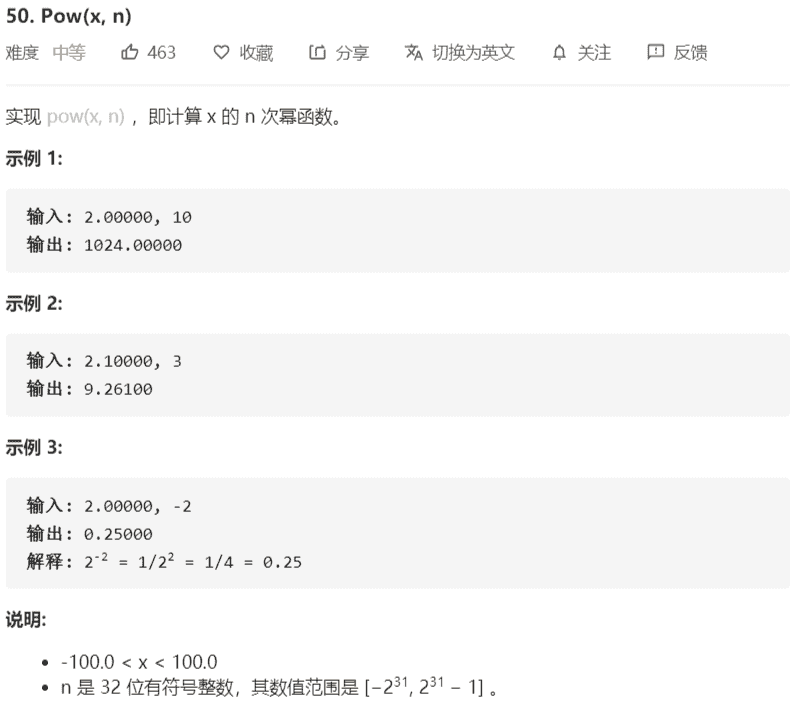

# 50-Pow(x,n)



解法：

1. 递归
2. 快速幂算法

```java
// 递归
class Solution {
    public double myPow(double x, int n) {
        if (n == 0) return 1;
        if (n == 1) return x;
        if (n == -1) return 1 / x;
        double half = myPow(x, n / 2);
        double rest = myPow(x, n % 2);
        return half * half * rest;
    }
}

// 快速幂算法
class Solution {
    public double myPow(double x, int n) {
        if (x == 1.0){
            // 排除1.0，减少计算量
            return x;
        }
        double sum = 1.0;
        if (n == Integer.MIN_VALUE) {
            // 负数比正数表示范围大1，排除
            x = 1 / x;
            n = Integer.MAX_VALUE;
            sum = x;
        }
        if (n < 0) {
            x = 1 / x;
            n = -n;
        }
        double tmp = x;
        while (n != 0) {
            sum *= ((n & 1) == 1 ? tmp : 1);
            n >>= 1;
            tmp *= tmp;
        }
        return sum;
    }
}
```

