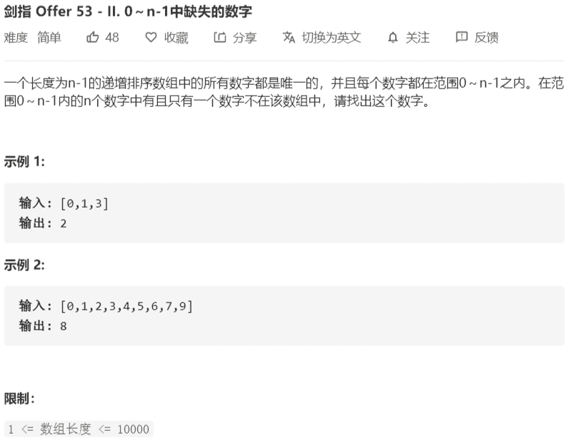

# 53-剑指-0到n-1中缺失的数字



解法：

题目意思：长度为 n 的递增排序数组，数组的每个值唯一且都在范围[0, n]之间，求缺少的那一位。
思路：

1. 递增排序数组，就可以想到使用二分查找;
2. 未缺失时，数组中存在 nums[i] = i；
3. 使用二分查找查找范围在[0 ,nums.length)
   - 如果nums[mid] = mid，说明缺失发生在后半部分[mid+1 ,right)，即left = mid + 1
   - 如果nums[mid] > mid，说明缺失发生在前半部分[left,mid)，即right = mid
   - 当 left == mid 时，表明该值即为缺失值

```java
class Solution {
    public int missingNumber(int[] nums) {
        // 有序数组使用二分查找
        int left = 0;
        int right = nums.length;

        while (left < right){
            int mid = (right + left)>>1;
            if (mid == nums[mid]){
                left = mid + 1;
            } else {
                right = mid;
            }
        }
        return left;
    }
}
```

