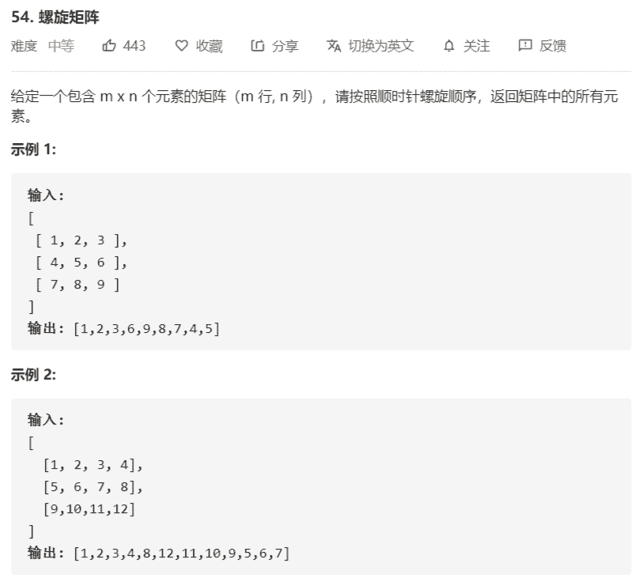

# 54-螺旋矩阵



解法：

```java
class Solution {
    public List<Integer> spiralOrder(int[][] matrix) {
        List<Integer> res = new ArrayList<>();
        if (matrix.length < 1 || matrix[0].length < 1) {
            return res;
        }
        int left = 0;
        int right = matrix[0].length - 1;
        int top = 0;
        int bottom = matrix.length - 1;
        while (left <= right && top <= bottom) {
            // left top -> right top
            for (int i = left; i <= right; i++) {
                res.add(matrix[top][i]);
            }
            top++;
            // right top -> right bottom
            for (int i = top; i <= bottom; i++) {
                res.add(matrix[i][right]);
            }
            right--;
            
            if (top > bottom || left > right) break;

            // right bottom -> left bottom
            for (int i = right; i >= left; i--) {
                res.add(matrix[bottom][i]);
            }
            bottom--;
            if (top > bottom) break;
            // left bottom -> left top
            for (int i = bottom; i >= top; i--) {
                res.add(matrix[i][left]);
            }
            left++;
        }
        return res;
    }
}
```

