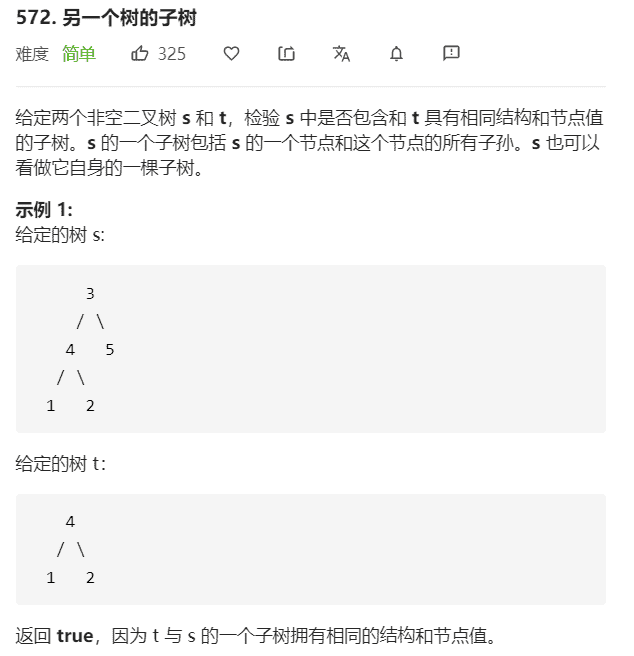

# 另一棵树的子树




返回false，不匹配

**解法：**

```java
/**
 * Definition for a binary tree node.
 * public class TreeNode {
 *     int val;
 *     TreeNode left;
 *     TreeNode right;
 *     TreeNode() {}
 *     TreeNode(int val) { this.val = val; }
 *     TreeNode(int val, TreeNode left, TreeNode right) {
 *         this.val = val;
 *         this.left = left;
 *         this.right = right;
 *     }
 * }
 */
class Solution {
    public boolean isSubtree(TreeNode s, TreeNode t) {
        return serialize(s).contains(serialize(t));
    }

    // 二叉树的序列化，非空节点：值!；空节点：#!；空节点也需要被序列化
    // 使用后序遍历，如果使用前序遍历的话，每个节点前需要使用 ?值! 表示
    private String serialize(TreeNode node) {
        StringBuilder builder = new StringBuilder();
        postOrderTraversal(node, builder);
        return builder.toString();
    }

    private void postOrderTraversal(TreeNode node, StringBuilder builder) {
        if (node == null) {
            builder.append("#!");
            return;
        }
        postOrderTraversal(node.left, builder);
        postOrderTraversal(node.right, builder);
        builder.append(node.val).append("!");
    }
}
```

