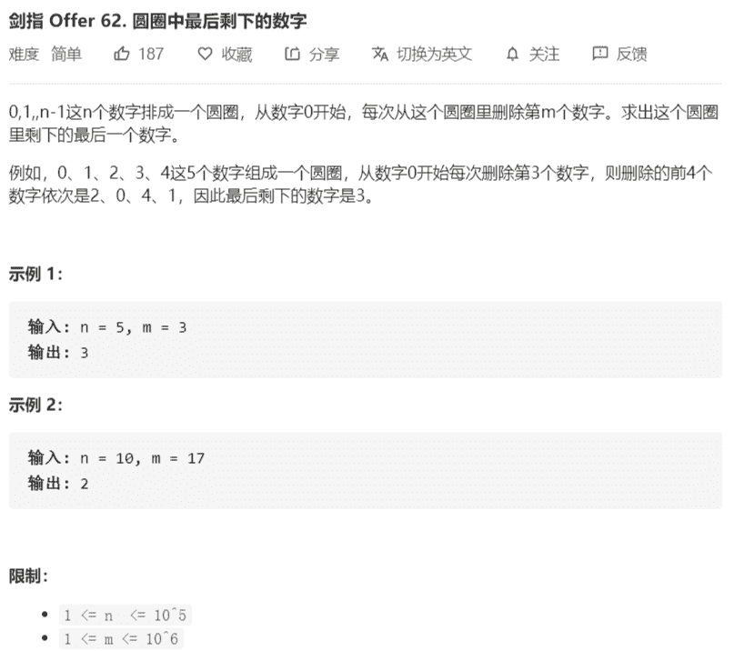

# 62-剑指-圆圈中最后剩下的数字



解法：

公式：`f(n , m) = (f(n - 1, m) + m) % n`

```java
class Solution {
    public int lastRemaining(int n, int m) {
        return n == 1 ? 0 : (lastRemaining(n - 1, m) + m) % n;
    }
}

// 非递归
class Solution {
    public int lastRemaining(int n, int m) {
        int res = 0;
        // i指数据规模
        for (int i = 2; i <= n; i++) {
            res = (res + m) % i;
        }
        return res;
    }
}
```

