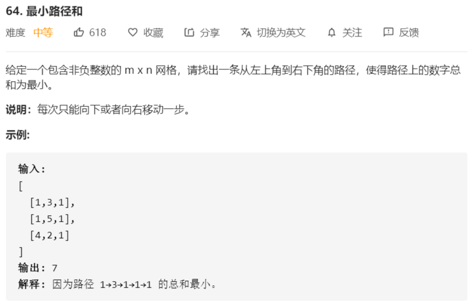

# 64-最小路径和



```java
class Solution {
    public int minPathSum(int[][] grid) {
        // dp
        if (grid.length < 1 || grid[0].length < 1) {
            return 0;
        }
        int row = grid.length;
        int col = grid[0].length;
        int[][] dp = new int[row][col];
        dp[0][0] = grid[0][0];
        for (int i = 1; i < col; i++) {
            dp[0][i] = dp[0][i - 1] + grid[0][i];
        }
        for (int i = 1; i < row; i++) {
            dp[i][0] = dp[i - 1][0] + grid[i][0];
        }
        for (int i = 1; i < row; i++) {
            for (int j = 1; j < col; j++) {
                dp[i][j] = Math.min(dp[i][j - 1], dp[i - 1][j]) + grid[i][j];
            }
        }
        return dp[row - 1][col - 1];
    }
}
```

