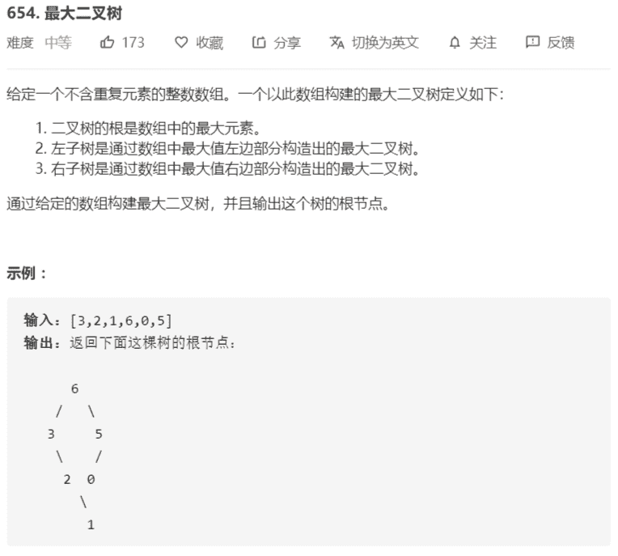

# 最大二叉树




**解法：**

```java
/**
 * Definition for a binary tree node.
 * public class TreeNode {
 *     int val;
 *     TreeNode left;
 *     TreeNode right;
 *     TreeNode(int x) { val = x; }
 * }
 */
// 递归解法
class Solution {
    public TreeNode constructMaximumBinaryTree(int[] nums) {
        return constructMaximumBinaryTree(nums, 0, nums.length);
    }

    private TreeNode constructMaximumBinaryTree(int[] nums, int start, int end) {
        if (start == end - 1) {
            return new TreeNode(nums[start]);
        }
        if (start == end) {
            return null;
        }
        int max = maxIndex(nums, start, end);
        TreeNode head = new TreeNode(nums[max]);
        head.left = constructMaximumBinaryTree(nums, start, max);
        head.right = constructMaximumBinaryTree(nums, max + 1, end);
        return head;
    }

    private int maxIndex(int[] nums, int start, int end) {
        int max = start;
        for (int i = start + 1; i < end; i++) {
            if (nums[i] >= nums[max]) {
                max = i;
            }
        }
        return max;
    }
}

// 最小栈解法：时间复杂度略高
class Solution {
    public TreeNode constructMaximumBinaryTree(int[] nums) {
        Stack<Integer> stack = new Stack<>();
        // 返回根节点数组
        TreeNode[] res = new TreeNode[nums.length];
        for (int i = 0; i < res.length; i++) {
            res[i] = new TreeNode(nums[i]);
        }
        for (int i = 0; i < nums.length; i++) {
            // 如果添加的元素不满足小于栈顶元素
            while (!stack.isEmpty() && nums[i] > nums[stack.peek()]) {
                int tmp = stack.pop();
                if (stack.isEmpty()) {
                    res[i].left = res[tmp];
                    break;
                } else {
                    // 父节点为栈顶元素和新增元素中较小的一个
                    if (nums[i] > nums[stack.peek()]){
                        res[stack.peek()].right = res[tmp];
                    } else {
                        res[i].left = res[tmp];
                    }
                }
            }
            stack.push(i);
        }
        TreeNode head = null;
        while (!stack.isEmpty()) {
            int tmp = stack.pop();
            if (stack.isEmpty()){
                head = res[tmp];
            } else {
                res[stack.peek()].right = res[tmp];
            }
        }
        return head;
    }
}

// 数组模拟栈
class Solution {
    public TreeNode constructMaximumBinaryTree(int[] nums) {
        // 数组模拟栈
        int[] stack = new int[nums.length];
        int pos = -1;

        // 返回根节点数组
        TreeNode[] res = new TreeNode[nums.length];
        for (int i = 0; i < res.length; i++) {
            res[i] = new TreeNode(nums[i]);
        }
        
        for (int i = 0; i < nums.length; i++) {
            // 如果添加的元素不满足小于栈顶元素
            while (pos > -1 && nums[i] > nums[stack[pos]]) {
                TreeNode tmp = res[stack[pos--]];
                if (pos < 0) {
                    res[i].left = tmp;
                    break;
                } else {
                    // 父节点为栈顶元素和新增元素中较小的一个
                    if (nums[i] > nums[stack[pos]]){
                        res[stack[pos]].right = tmp;
                    } else {
                        res[i].left = tmp;
                    }
                }
            }
            stack[++pos] = i;
        }
        TreeNode head = null;
        while (pos > -1) {
            TreeNode node = res[stack[pos--]];
            if (pos < 0){
                head = node;
            } else {
                res[stack[pos]].right = node;
            }
        }
        return head;
    }
}
```

### 题目变化

同样的输入，同样的构建方法，要求返回一个数组，数组里面存着每个节点的父节点的索引（如果没有父节点，存值 -1）

解法：利用栈求左、右第一个比它大的数，栈为从栈底往栈顶单调递减

```java
    public int[] constructMaximumBinaryTree1(int[] nums) {
        // 使用单调递减栈，方法：
        // 1.扫描一边所有的元素
        // 2.保持栈从栈底到栈顶单调递减

        // 此题要求返回父节点的索引，即左边和右边比它大的数中较小的一个
        Stack<Integer> stack = new Stack<>();
        // 返回根节点数组
        int[] res = new int[nums.length];
        for (int i = 0; i < nums.length; i++) {
            // 如果添加的元素不满足小于栈顶元素
            while (!stack.isEmpty() && nums[i] > nums[stack.peek()]) {
                int tmp = stack.pop();
                if (stack.isEmpty()) {
                    res[tmp] = i;
                    break;
                } else {
                    // 父节点为栈顶元素和新增元素中较小的一个
                    res[tmp] = nums[i] > nums[stack.peek()] ? stack.peek() : i;
                }
            }
            stack.push(i);
        }
        while (!stack.isEmpty()) {
            res[stack.pop()] = stack.isEmpty() ? -1 : stack.peek();
        }
        return res;
    }
```

