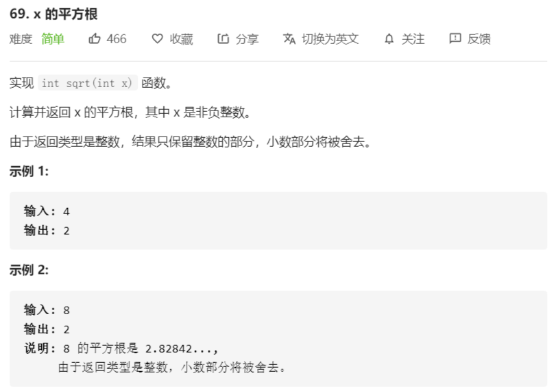
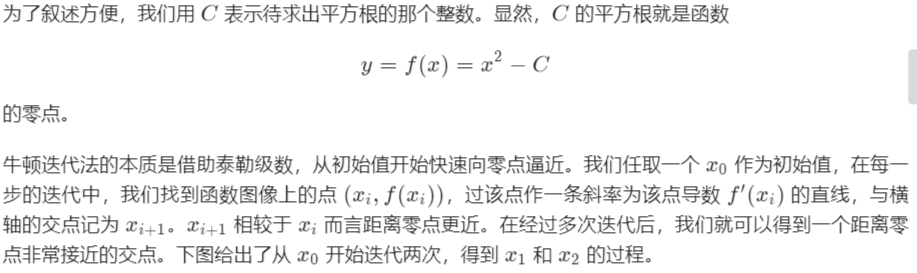
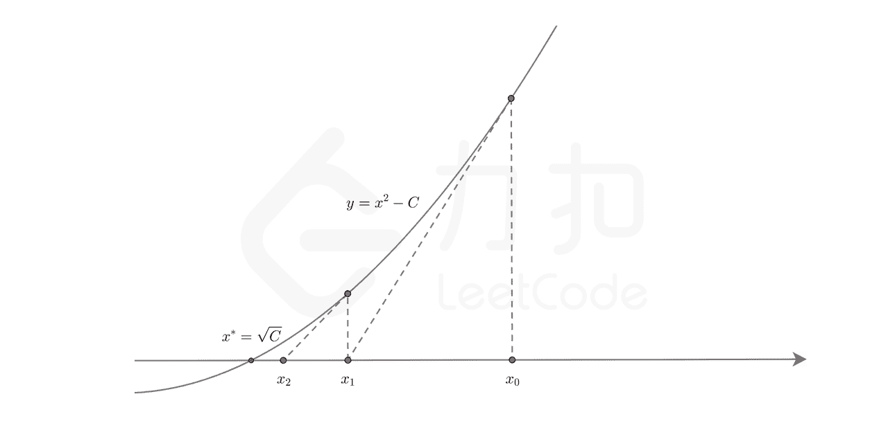
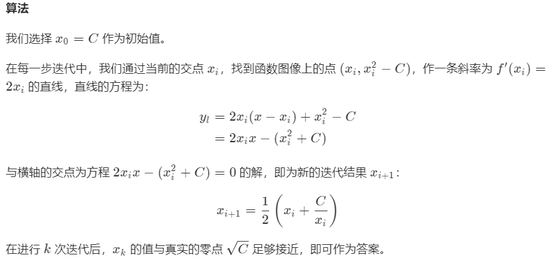
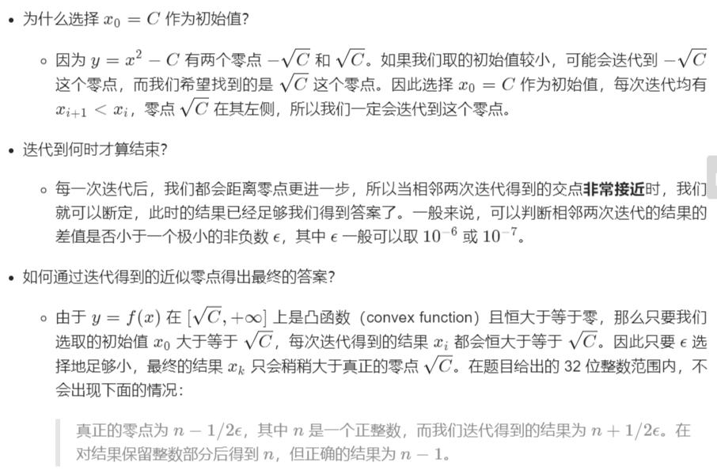

# 69-x的平方根



### 解法

##### 牛顿迭代

牛顿迭代：一种快速求解函数零点的方法









```java
class Solution {
    public int mySqrt(int x){
        if (x == 0) {
            return 0;
        }
        double C = x;
        double x0 = x;
        while (true) {
            double xi = 0.5 * (x0 + C / x0);
            if (Math.abs(x0 - xi) < 1e-7) {
                break;
            }
            x0 = xi;
        }
        return (int) x0;
    }
}
```

##### 二分法

1. 注意越界问题
2. 采用左闭右开区间

```java
class Solution {
    public int mySqrt(int x){
        int l = 0, r = x, ans = -1;
        while (l <= r) {
            int mid = l + (r - l) / 2;
            if ((long)mid * mid <= x) {
                ans = mid;
                l = mid + 1;
            }
            else {
                r = mid - 1;
            }
        }
        return ans;
    }
}
```

