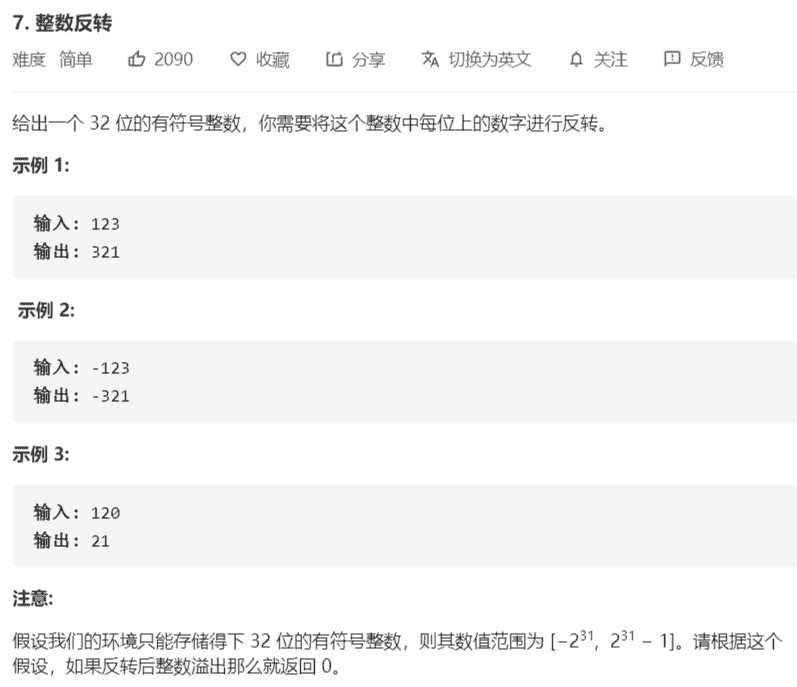

# 7-整数反转



解法：

```java
class Solution {
    public int reverse(int x) {
        long res = 0;
        while (x != 0) {
            res = res * 10 + (x % 10);
            x /= 10;
        }
        return res > Integer.MAX_VALUE || res < Integer.MIN_VALUE ?
            0 : (int) res;
    }
}

class Solution {
    public int reverse(int x) {
        int res = 0;
        while (x != 0) {
            int preRes = res;
            res = res * 10 + (x % 10);
            if ((res - x % 10) / 10 != preRes) {
                return 0;
            }
            x /= 10;
        }
        return res;
    }
}
```

