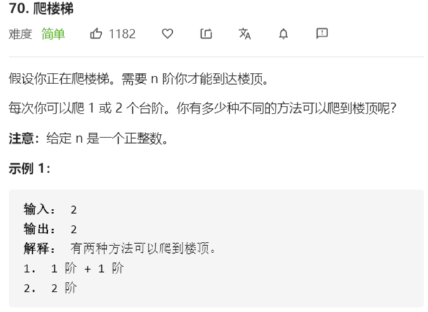

# 70-爬楼梯



解法：

```java
class Solution {
    public int climbStairs(int n) {
        // dp数组
        int[] dp = new int[n + 1];
        // dp初值
        dp[0] = 1;
        dp[1] = 1;
        for(int i = 2;i <= n;i++){
            dp[i] = dp[i-1] + dp[i-2];
        }
        return dp[n];
    }
}
```

