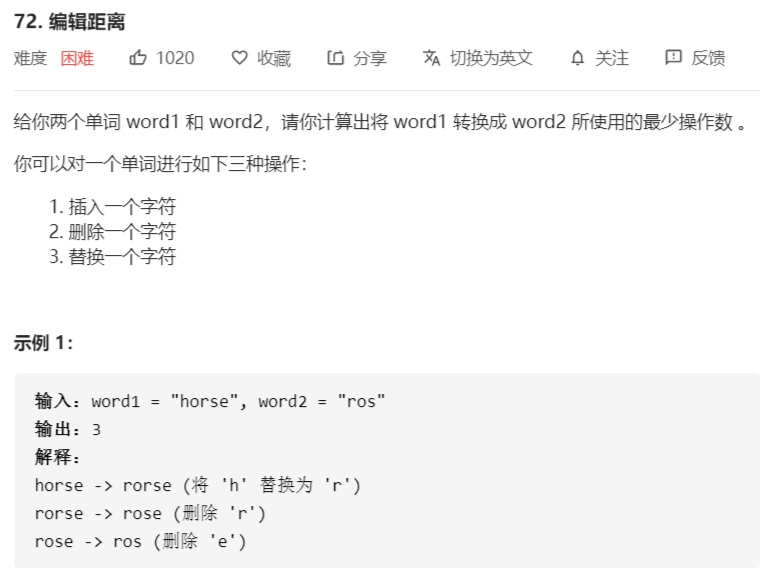
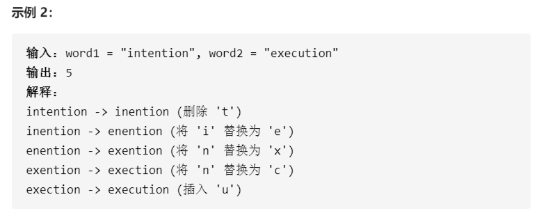

# 编辑距离





解法：

```java
class Solution {
    public int minDistance(String word1, String word2) {
        if (word1.length() < 1 || word2.length() < 1) {
            return word1.length() < 1 ? word2.length() : word1.length();
        }
        char[] c1 = word1.toCharArray();
        char[] c2 = word2.toCharArray();

        int l1 = c1.length + 1;
        int l2 = c2.length + 1;

        int[][] dp = new int[l1][l2];

        // 初始化
        for (int i = 0; i < l1; i++) {
            dp[i][0] = i;
        }
        for (int i = 1; i < l2; i++) {
            dp[0][i] = i;
        }

        // dp的状态转移方程：
        // 初始化dp数组：dp[0][0] = 0; dp[i][0] = i;  dp[0][i] = i;
        // 其他情况：以下四种情况的最小值
        // dp[i][j] = 1 + dp[i-1][j] || 1 + dp[i][j-1] ||
        // dp[i][j] = dp[i-1][j-1] + (c1[i] == c2[j] ? 0:1);
        for (int i = 1; i < l1; i++) {
            for (int j = 1; j < l2; j++) {
                dp[i][j] = c1[i - 1] == c2[j - 1] ? dp[i - 1][j - 1] : dp[i - 1][j - 1] + 1;
                dp[i][j] = Math.min(dp[i][j], Math.min(dp[i - 1][j], dp[i][j - 1]) + 1);
            }
        }
        return dp[l1 - 1][l2 - 1];
    }
}
```

