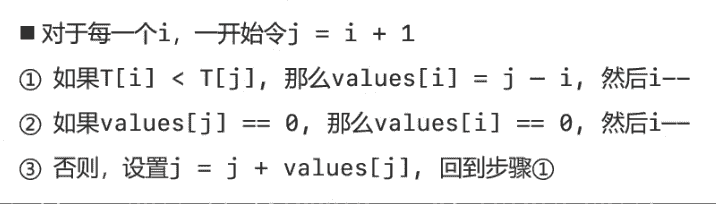

# 每日温度


解法：

- 最小栈：

    1. 使用最小栈：构建一个从栈底到栈顶逐渐递减的栈，如果栈不为空，将栈顶元素的值与即将入栈的元素进行比较 ，如果栈顶元素值小于即将入栈的元素，说明栈顶元素的右边最大值为入栈的元素，将栈顶元素出栈，然后设置出栈元素的需要等待的天数为 栈顶元素索引 - 出栈元素索引；其他情况将索引入栈
    2. 循环结束后，栈中其他元素为没有右边较大值的元素，置 0 
    
- 倒推法：

    

- 倒推法精简版：

    

```java
// 利用java提供的Stack，效率感人，内存占用感人
class Solution {
    public int[] dailyTemperatures(int[] T) {
        // 利用最小栈来解题
        int[] res = new int[T.length];
        Stack<Integer> stack = new Stack<>();

        for (int i = 0; i < T.length; i++) {
            while (!stack.isEmpty() && T[stack.peek()] < T[i]) {
                res[stack.peek()] = i - stack.pop();
            }
            stack.push(i);
        }
        while (!stack.isEmpty()){
            res[stack.pop()] = 0;
        }
        return res;
    }
}

// 利用数组模拟栈
class Solution {
    public int[] dailyTemperatures(int[] T) {
        // 利用最小栈来解题
        // 自己实现的栈效率比较高
        int[] res = new int[T.length];
        int[] stack = new int[T.length];
        // 栈顶指针：指向栈最顶端的元素
        int pos = -1;

        for (int i = 0; i < T.length; i++) {
            while (pos > -1 && T[stack[pos]] < T[i]) {
                res[stack[pos]] = i - stack[pos--];
            }
            stack[++pos] = i;
        }
        while (pos > -1) {
            res[stack[pos--]] = 0;
        }
        return res;
    }
}

// 倒推法
class Solution {
    public int[] dailyTemperatures(int[] T) {
        int[] res = new int[T.length];

        for (int i = T.length - 2; i >= 0; i--) {
            int j = i + 1;
            while (true) {
                if (T[i] < T[j]) {
                    res[i] = j - i;
                    break;
                } else if (res[j] == 0) {
                    // res[j]==0且T[j]>=T[i]
                    res[i] = 0;
                    break;
                } else if (T[i] == T[j]) {
                    res[i] = res[j] + j - i;
                    break;
                } else {
                    j = j + res[j];
                }
            }
        }
        return res;
    }
}

// 倒推法精简版
class Solution {
    public int[] dailyTemperatures(int[] T) {
        int[] res = new int[T.length];

        for (int i = T.length - 2; i >= 0; i--) {
            int j = i + 1;
            while (true) {
                if (T[i] < T[j]) {
                    res[i] = j - i;
                    break;
                } else if (res[j] == 0) {
                    // res[j]==0且T[j]>=T[i]
                    res[i] = 0;
                    break;
                } 
                j = j + res[j];
            }
        }
        return res;
    }
}
```

