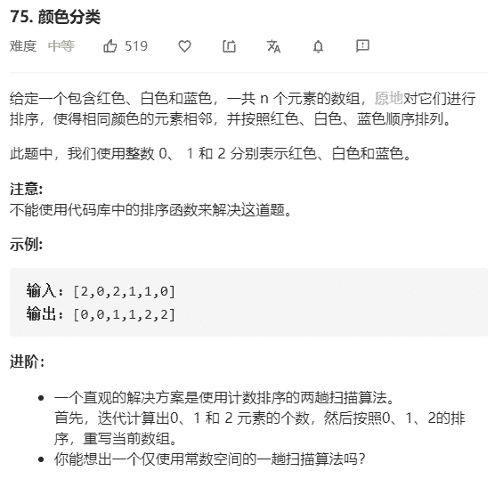

# 颜色分类



解法：

```java
// 先扫描计数0，1，2的个数，然后填充
class Solution {
    public void sortColors(int[] nums) {
        int[] res = new int[3];
        for (int num : nums) {
            res[num]++;
        }
        Arrays.fill(nums, 0, res[0], 0);
        Arrays.fill(nums, res[0], res[0] + res[1], 1);
        Arrays.fill(nums, res[0] + res[1], nums.length, 2);
    }
}

// start：0的索引位置；end：2的索引位置；pos：遍历索引位置
// 遍历，遇到1：跳过 pos++；
// 遍历，遇到0：跟start交换值，pos++，start++
// 遍历，遇到2：跟end交换，end--；再次对pos位置进行判断
class Solution {
    public static void sortColors(int[] nums) {
        // 0的索引位置
        int start = 0;
        // 2的索引位置
        int end = nums.length - 1;
        // 遍历指针
        int pos = 0;
        while (pos <= end) {
            if (nums[pos] == 0) {
                // 2已经被放到后面，前面的为1，pos自增
                nums[pos++] = nums[start];
                nums[start++] = 0;
            } else if (nums[pos] == 2) {
                // 后面的位置不一定，故pos不自增
                nums[pos] = nums[end];
                nums[end--] = 2;
            } else {
                // 为1，自增
                pos++;
            }
        }
    }
}
```

