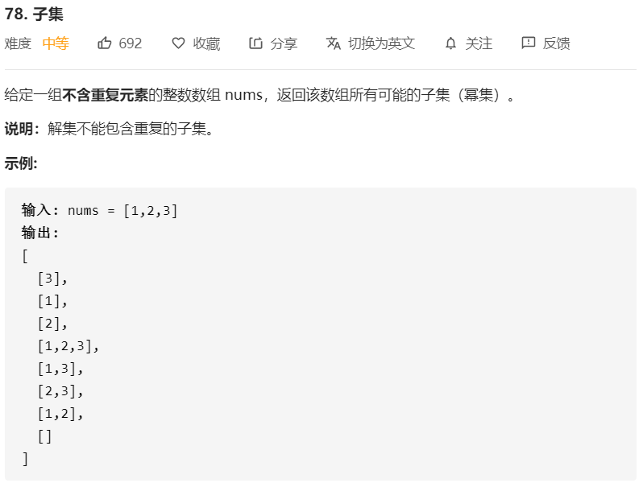

# 78-子集



解法：

解决全排列、组合、子集问题，比较相似，且可以使用一些通用的策略解决：

1. 首先，它们的解空间非常大：

   - 全排列：N！
   - 组合：N！
   - 子集：2^N，每个元素都可能存在与不存在

2. 在它们的指数级解法中，要确保生成的结果完整且无冗余，有三种常用的方法：

   - 递归
   - 回溯
   - 基于二进制位掩码和对应掩码之间的映射字典生成排列、组合、子集

   相比于前两种方法，第三种方法将每种情况都简化为二进制数，易于实现和验证；且第三种方法具有最优的时间复杂度，可以按照字典顺序输出结果。

递归解法：

顺序遍历，遍历到每一位值，将前面的所有子集添加新的整数，并生成新的子集：

```java
public static List<List<Integer>> subsets(int[] nums) {
    // 结果数组，长度为 2^nums.length，即 1 << nums.length
    List<List<Integer>> ans = new ArrayList<>(1 << nums.length);
    // 将空集添加进去
    ans.add(new ArrayList<Integer>());
    // 循环遍历
    for (int num : nums) {
        List<List<Integer>> newSubsets = new ArrayList<>();
        for (List<Integer> list : ans) {
            // 遍历到一个元素，将之间的子集复制一份再逐个添加新元素
            newSubsets.add(new ArrayList<Integer>(list){{add(num);}});
        }
        for (List<Integer> list : newSubsets){
            // 将新的子集放入结果数组
            ans.add(list);
        }
    }
    return ans;
}
```

回溯解法：

> 幂集是所有长度从0到n所有子集的组合

根据定义，该问题可以看作是从序列中生成幂集。遍历子集长度，通过回溯生成所有给定长度的子集。

回溯法是一种探索所有潜在可能性找到解决方案的算法。如果当前方案不是正确的解决方案，或者不是最后一个正确的解决方案，则回溯法通过修改上一步的值继续寻找解决方案。

```java

class Solution {
  List<List<Integer>> output = new ArrayList();
  int n, k;

  public void backtrack(int first, ArrayList<Integer> curr, int[] nums) {
    // if the combination is done
    if (curr.size() == k)
      output.add(new ArrayList(curr));

    for (int i = first; i < n; ++i) {
      // 将i添加进现有组合
      curr.add(nums[i]);
      // 使用下一个元素完成组合
      backtrack(i + 1, curr, nums);
      // 回溯
      curr.remove(curr.size() - 1);
    }
  }

  public List<List<Integer>> subsets(int[] nums) {
    n = nums.length;
    for (k = 0; k < n + 1; ++k) {
      backtrack(0, new ArrayList<Integer>(), nums);
    }
    return output;
  }
}
```

二进制排序：

将每个子集映射到长度为 n 的位掩码中，其中第 i 位掩码 nums[i] 为 1，表示第 i 个元素在子集中；如果第 i 位掩码 nums[i] 为 0，表示第 i 个元素不在子集中。

```java
class Solution {
    public List<List<Integer>> subsets(int[] nums) {
        // nums不含重复元素，因此该数组所有可能子集个数为2^nums.length
        // 使用二进制表示
        int len = nums.length;
        // 结果集长度
        int end = 1 << nums.length;
        // 结果 
        List<List<Integer>> ans = new ArrayList<>(end);

        for (int i=0;i < end;i++){
            List<Integer> list = new ArrayList<>();
            int tmp = i;
            for(int j = 0;j < len;j++){
                if ((tmp & 1) > 0){
                    list.add(nums[j]);
                }             
                tmp >>= 1;
            }
            ans.add(list);
        }
        return ans;
    }
}
```

