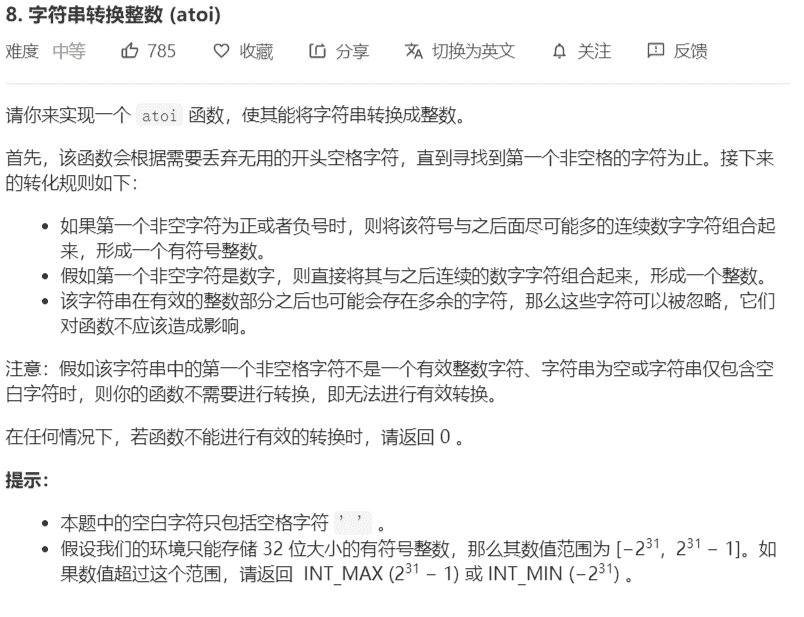
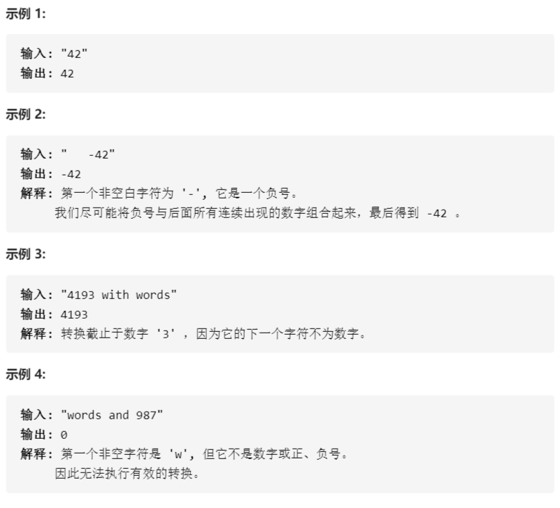

# 8-字符串转换整数





解法：

```java
class Solution {
    public int myAtoi(String str) {
        long res = 0;
        int max = Integer.MAX_VALUE;
        char[] cs = str.toCharArray();
        boolean flag = false;
        // 去掉开头的空格字符
        int pos = 0;
        while (pos < cs.length && cs[pos] == ' '){
            pos++;
        }
        // 如果字符串全为空格
        if (pos == cs.length) return 0;
        // 判断开头的是否为'+'、'-'
        if (pos < cs.length && ( cs[pos] == '+' || cs[pos] == '-')){
            flag = cs[pos] == '-';
            pos++;
        } 
        // 转换
        for (int i = pos;i < cs.length; i++){
            if (cs[i] < '0' || cs[i] > '9') break;
            res = res*10 + cs[i] - '0'; 
            // 当res比int表示的最大范围还大，退出循环
            if (res > max){
                break;
            }
        }
        return flag ? 
            ( res > max ? Integer.MIN_VALUE : (int)(-res)):
            ( res > max ? Integer.MAX_VALUE : (int)res);
    }
}
```

