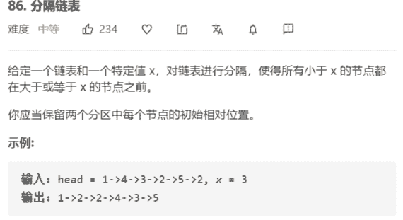

# 分隔链表



解法：

```java
class Solution {
    public ListNode partition(ListNode head, int x) {
        if (head == null || head.next == null) {
            return head;
        }
        // 虚拟双头节点
        // 小于x的节点
        ListNode newHead = new ListNode(0);
        ListNode l = newHead;
        
        // 大于x的节点
        ListNode right = new ListNode(0);
        ListNode r = right;

        while (head != null) {
            if (head.val < x) {
                l.next = head;
                l = l.next;
            } else {
                r.next = head;
                r = r.next;
            }
            head = head.next;
        }
        // 记得将r.next置null，免得成环
        r.next = null;
        l.next = right.next;
        return newHead.next;
    }
}
```

