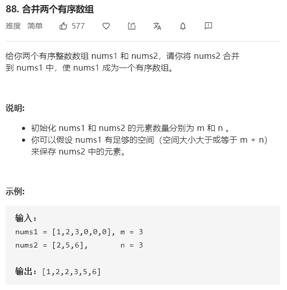

# 合并两个有序数组



解法：

```java
class Solution {
    public void merge(int[] nums1, int m, int[] nums2, int n) {
        // 由题意，最后的结果应该保存在nums1中，且nums1和nums2有序
        // 因此，可以从后往前进行比较填充

        // 合并后的数组末位
        int len = m + n - 1;
        // nums1末位
        m--;
        // nums2末位
        n--;
        while(m>=0 && n>=0){
            nums1[len--] = nums1[m] > nums2[n] ? nums1[m--]:nums2[n--];
        }
        // 进行一次判定，看nums2数组是否存在未参与比较的值，直接复制即可，有两种方法
        
        // 1.循环
        while(n>=0){
            nums1[len--] = nums2[n--];
        }
        
        // 2.System.arraycopy()数组拷贝函数
        if(n>=0){
            System.arraycopy(nums2,0,nums1,0,n+1);
        }
    }
}

// 更加精简的写法
class Solution {
    public void merge(int[] nums1, int m, int[] nums2, int n) {
        // 合并后的数组末位
        int len = m + n - 1;
        // nums1末位
        m--;
        // nums2末位
        n--;
        while(n>=0){
            if(m>=0 && nums1[m]>nums2[n]){
                nums1[len--] = nums1[m--];
            }else{
                nums1[len--] = nums2[n--];
            }
        }
    }
}
```

