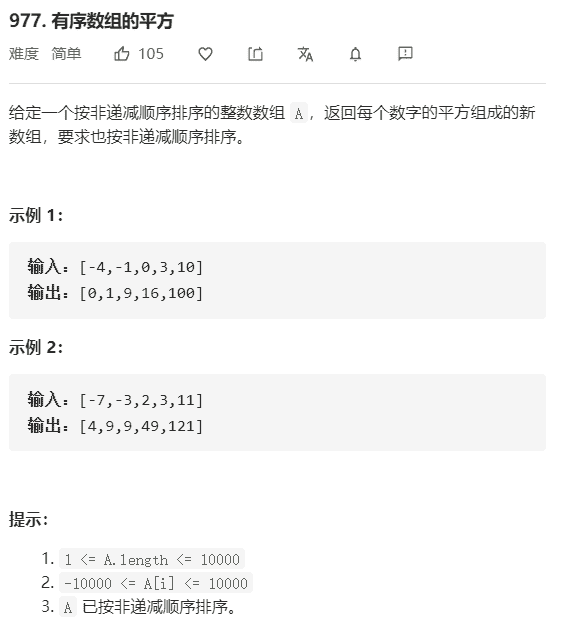

# 有序数组的平方



解法：

```java
class Solution {
    public int[] sortedSquares(int[] A) {
        for (int i = 0; i < A.length; i++) {
            A[i] = A[i] * A[i];
        }
        int[] res = new int[A.length];
        int l = 0;
        int r = A.length - 1;
        int pos = A.length - 1;
        while (l <= r) {
            res[pos--] = A[l] > A[r] ? A[l++] : A[r--];
        }
        return res;
    }
}
```

