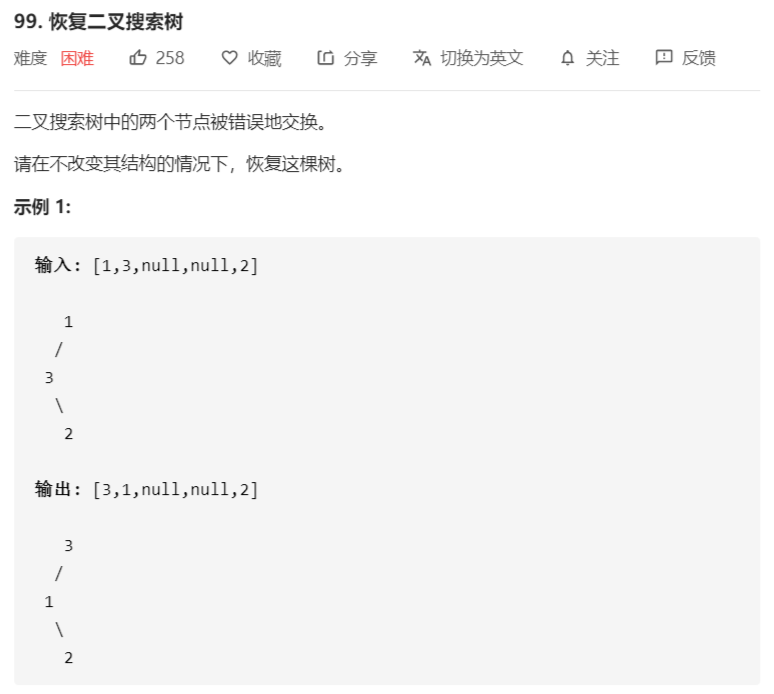

# 恢复二叉搜索树




解法：


````java
/**
 * Definition for a binary tree node.
 * public class TreeNode {
 *     int val;
 *     TreeNode left;
 *     TreeNode right;
 *     TreeNode() {}
 *     TreeNode(int val) { this.val = val; }
 *     TreeNode(int val, TreeNode left, TreeNode right) {
 *         this.val = val;
 *         this.left = left;
 *         this.right = right;
 *     }
 * }
 */
class Solution {
    public void recoverTree(TreeNode root) {
        // 二叉搜索树中序遍历结果为升序的
        findWrongNode(root);
        int val = first.val;
        first.val = second.val;
        second.val = val;
    }

    // 上一次中序遍历过的节点
    private TreeNode prev = null;
    // 第一个错误节点
    private TreeNode first = null;
    // 第二个错误节点
    private TreeNode second = null;

    // 该中序遍历的空间复杂度为O(h)，h为二叉树的高度
    // 时间复杂度为 O(n)
    private void findWrongNode(TreeNode node) {
        if (node == null) {
            return;
        }
        findWrongNode(node.left);
        
        // 出现了逆序对
        if (prev != null && prev.val > node.val) {
            // 第2个错误节点：最后一个逆序对中较小的那个节点
            second = node;
            // 第1个错误节点：第一个逆序对中的较大节点
            if (first != null) {
                return;
            }
            first = prev;
        }
        prev = node;
        
        findWrongNode(node.right);
    }
}
````

空间复杂度为 O(1) 的中序遍历：Morris 遍历，可以实现时间复杂度O(n)、空间复杂度O(1)


Morris遍历步骤：假设遍历找到的当前节点是 N

1. 如果 N.left != null，找到 N 的前驱节点 P
   - 如果P.right == null，则令：P.right = N，N = N.left
   - 如果P.right == N，则令：P.right = null，输出N，N = N.right，重新执行步骤1
2. 如果 N.left == null，打印 N，N=N.right，回到步骤 1
3. 重复1和2，直到N == null

```java
class Solution {
    public void recoverTree(TreeNode root) {
        // 使用Morris遍历

        // 用于遍历的节点
        TreeNode node = root;
        // 用于遍历的前驱节点
        TreeNode pred = null;
        while (node != null) {
            if (node.left != null) {
                // 找到前驱节点
                pred = node.left;
                while (pred.right != null && pred.right != node) {
                    pred = pred.right;
                }
                
                if (pred.right == null) {
                    pred.right = node;
                    node = node.left;
                } else {
                    pred.right = null;
                    findWrongNodes(node);
                    node = node.right;
                }
            } else {
                findWrongNodes(node);
                node = node.right;
            }
        }

        // 交换两个错误的节点的值
        int val = first.val;
        first.val = second.val;
        second.val = val;
    }

    // 上一次中序遍历过的节点
    private TreeNode prev = null;
    // 第一个错误节点
    private TreeNode first = null;
    // 第二个错误节点
    private TreeNode second = null;

    private void findWrongNodes(TreeNode node) {
        // 处理阶段
        if (prev != null && prev.val > node.val) {
            second = node;
            first = first == null ? prev : first;
        }
        prev = node;
    }
}
```

