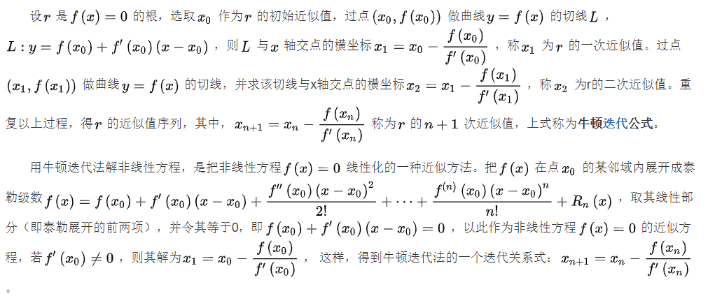

# 牛顿迭代的原理



- 已经证明，如果是连续的，并且待求的零点是孤立的，那么在零点周围存在一个区域，只要初始值位于这个邻近区域内，那么牛顿法必定收敛。 并且，如果不为0, 那么牛顿法将具有平方收敛的性能. 粗略的说，这意味着每迭代一次，牛顿法结果的有效数字将增加一倍。
- 迭代法也称辗转法，是一种不断用变量的旧值递推新值的过程，跟迭代法相对应的是直接法（或者称为一次解法），即一次性解决问题。迭代算法是用计算机解决问题的一种基本方法。它利用计算机运算速度快、适合做重复性操作的特点，让计算机对一组指令（或一定步骤）重复执行，在每次执行这组指令（或这些步骤）时，都从变量的原值推出它的一个新值。

迭代法计算：

1. 确认迭代变量：在可以用迭代算法解决的问题中，至少存在一个可直接或间接地不断由旧值递推出新值的变量，这个变量就是迭代变量。
2. 建立迭代关系式：所谓迭代关系式，指如何从变量的前一个值推出其下一个值的公式（或关系）。迭代关系式的建立是解决迭代问题的关键，通常可以使用递推或倒推的方法来完成。
3. 对迭代过程进行控制：在什么时候结束迭代过程？这是编写迭代程序必须考虑的问题。不能让迭代过程无休止地执行下去。迭代过程的控制通常可分为两种情况：一种是所需的迭代次数是个确定的值，可以计算出来；另一种是所需的迭代次数无法确定。对于前一种情况，可以构建一个固定次数的循环来实现对迭代过程的控制；对于后一种情况，需要进一步分析得出可用来结束迭代过程的条件。

求平方根：

1. f(x) = x^2 - c，求导 `f'(x) = 2*x` ，根据牛顿迭代关系式，求得算术平方根就是求  的正根，得迭代公式，c，代码中取值 c，误差控制在 `1*10^(-15)`

   java代码实现：

   ```java
       private static double sqrt(double c) {
           if (c < 0) {
               return Double.NaN;
           }
           // 误差值
           double e = 1e-15;
           double x = c;
           double y = (x + c / x) / 2;
           while (Math.abs(x - y) > e) {
               x = y;
               y = (x + c / x) / 2;
           }
           return x;
       }
   ```

   

